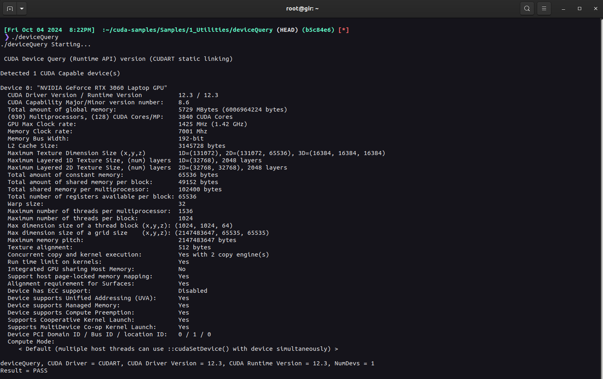
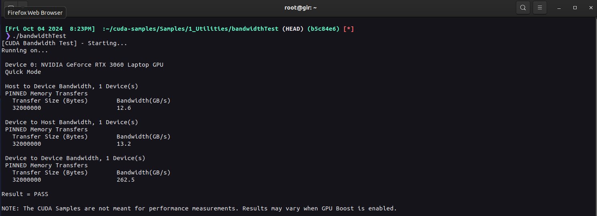
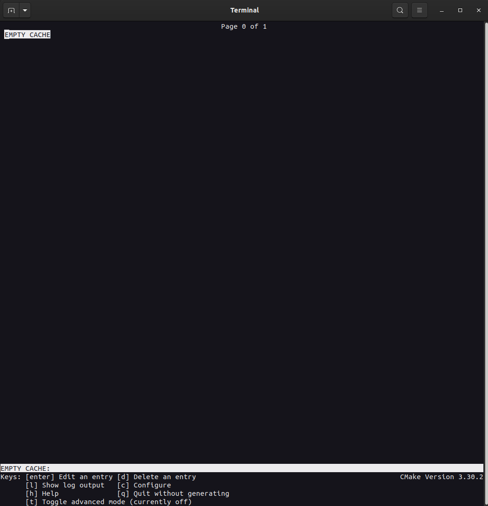
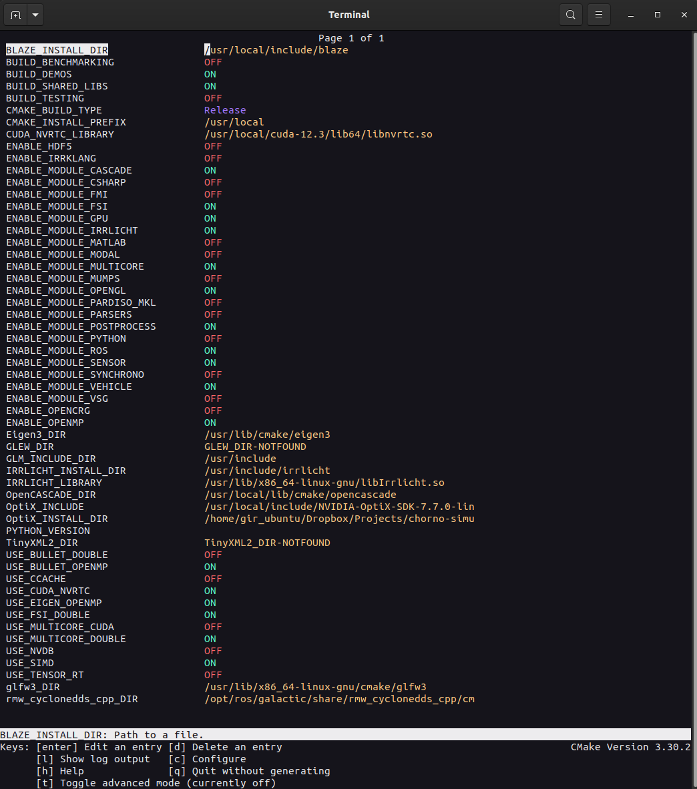

# ACSL Chorono Simulator - Installation Instructions

For the acsl-chrono-simulator to work, first configure the required dependencies. Then, if you desire, configure the optional dependencies. Finally, build the Chrono libraries.

## Table of Contents
- [Required Chrono Dependencies](#required)
  - [Git](#1-git)
  - [GCC](#2-install-gcc)
  - [LLVM Clang](#3-install-llvm-clang)
  - [CMake](#4-latest-cmake)
  - [Eigen](#5-eigen3-library)
  - [CUDA](#6-cuda-toolchain)
  - [OptiX](#7-install-nvidia-optix)
  - [Irrlicht](#8-installing-irrlicht)
  - [Blaze](#9-installing-blaze-libraries)
  - [Boost](#10-install-boost-libraries)
  - [GLFW, GLEW](#11-installing-glfw-and-glew)
  - [OpenGL](#12-install-opengl)
  - [OpenCASCADE](#13-install-opencascade)
  - [ROS2](#14-ros2-installation)
- [Optional Chrono Dependencies](#optional)
- [Build Chrono](#build-chrono-libraries)
- [Troubleshooting](#troubleshooting)

## Required

Before we proceed to install the dependencies, ensure that the system is up to date

```bash
sudo apt-get update -y && sudo apt-get upgrade
```

To successfully build and use [**Chorno 9.0.1**](https://github.com/projectchrono/chrono/tree/9.0.1), ensure the following dependencies are installed,

### 1. Git

Run the following commands in your Linux terminal to install Git

```bash
# Update the repository and install git
sudo apt-get update -y && sudo apt-get install git
```

### 2. Install GCC

Run the following commands in your Linux terminal to install GCC

```bash
# Update the repository and install GCC
sudo apt-get update -y && sudo apt install build-essential

# Check the version
gcc --version

# Check the version for GLIBC
ldd --version
```

> **IMPORTANT:** Make sure the GCC version is 4.9 or newer

> **NOTE:** The GCC version for ubuntu 20.04 should be 9.4.0 and the GLIBC version for Ubuntu 20.04 should be 2.31.

### 3. Install LLVM Clang

Run the following commands in your Linux terminal to install Clang

```bash
# Update the repositories and install clang
sudo apt-get update -y && sudo apt-get install clang

# Check the version
clang --version
```
> **IMPORTANT:** Make sure the Clang version is 1.6 or newer

### 4. Latest CMake

The ([CMake]()) is required to generate all the required make files for your specific toolchain

```bash
# Prepare for installation
sudo apt update && \
sudo apt install -y software-properties-common lsb-release && \
sudo apt clean all

# Obtain a copy of kitware's signing key
wget -O - https://apt.kitware.com/keys/kitware-archive-latest.asc 2>/dev/null | gpg --dearmor - | sudo tee /etc/apt/trusted.gpg.d/kitware.gpg >/dev/null

# Add kitware's repository to your sources list for Ubuntu
sudo apt-add-repository "deb https://apt.kitware.com/ubuntu/ $(lsb_release -cs) main"

# Update the repository list
sudo apt update

# Set up Keyring
sudo apt install kitware-archive-keyring

# Update and install CMake
sudo apt-get update
sudo apt install cmake

# Check version
cmake --version

# Now, install the GUI for cmake to use teminal based GUI
sudo apt install cmake-curses-gui
```

> **IMPORTANT:** Make sure the CMake version is atleast 3.20

### 5. Eigen3 library
Chrono now uses [**Eigen3**](https://eigen.tuxfamily.org/index.php?title=Main_Page) for all of its internal dense lineear algebra needs. Run the following to install the libraries in Linux

```bash
# Update and intall Eigen3 
sudo apt-get update && sudo apt install libeigen3-dev
```

> **NOTE:** This should install the latest Eigen3 libraries. As of time of writing it is version 3.3.7-2.

### 6. CUDA toolchain

The FSI module requires that the [CUDA Toolchain](https://developer.nvidia.com/cuda-12-3-0-download-archive) is installed. From the link, choose `Linux` as the OS, `x86_64` as the architecture, and `Ubuntu` as the distribution with your respective version. The current instructions are written for `Ubuntu 20.04`. Then proceed to pick `deb (local)` as the installer type and follow the instructions from the website to install both the _Cuda toolkit_ as well as the _NVIDIA Drivers_.

> **IMPORTANT:** Chrono 9.0.1 **only supports upto cuda 12.3**

> **IMPORTANT:** Follow the isntructions to install the `open kernel module flavor`

> **NOTE:** Dont forged to run the instructions from the home folder. Use the terminal commnad `cd ` to get to the home directory.

> **NOTE:** The _NVIDIA Drivers_ installer might prompt to setup secure-boot for the system. Follow the instructions on the terminal screen to set it up.


Now Run the following commands 

```bash
# Update the repository
sudo apt-get update

# Install the CUDA toolkit from packages
sudo apt-get install cuda-toolkit

# To include all GDS packages:
sudo apt-get install nvidia-gds

# Reboot the system
sudo reboot
```
> **IMPORTANT:** After your reboot you will be prompted with a GUI. Pick `Enroll MOK`. Follow the options to enroll the _MOK_. Input the password you used for the secure-boot.

Now, the necessary packages are installed. Perform post-installation checks. Add the following to the end of `.bashrc`

> **NOTE:** You can type in `sudo nano ~/.bashrc` for opening the file and then paste it at the end. and use _ctrl + o_ to write it out.

```bash
# path to the PATH variable
export PATH=/usr/local/cuda-12.3/bin${PATH:+:${PATH}}

# In addition, when using the runfile installation method, the LD_LIBRARY_PATH variable needs to contain /usr/local/cuda-12.3/lib64 on a 64-bit system
export LD_LIBRARY_PATH=/usr/local/cuda-12.3/lib64\
                         ${LD_LIBRARY_PATH:+:${LD_LIBRARY_PATH}}

```

Start the NVIDIA Persistence Daemon by running as the root user:

```bash
# Change to root user
sudo -i

# Start the persistencee daemon
nvidia-smi -pm 1

# exit root user
exit
```

Verify the installation by compiling some examples found at the [Github](https://github.com/nvidia/cuda-samples)

```bash
# Clone the repository - (I am cloning it in the home directory)
cd ~/ && git clone https://github.com/NVIDIA/cuda-samples.git

# Checkout the 12.3 version
cd cuda-samples && git checkout tags/v12.3

# Compile the samples
make -k
```

Once the installation has completed, find and run `deviceQuery` by running the following command

> **NOTE:** Make note that we compiled the `cuda-samples` in the home directory. If you complied it elsewhere, the path to the `deviceQuery` exeutable will be different.

```bash
# Navigate to home directory
cd ~/

# Run the device query test
./cuda-samples/Samples/1_Utilities/deviceQuery/deviceQuery
```

The output should looks like:

<p align="center">
  
</p>

<p align="center"><em>The exact appearance and the output lines might be different on your system. The important outcomes are that a device was found (the first highlighted line), that the device matches the one on your system (the second highlighted line), and that the test passed (the final highlighted line).</em></p>

Now runt the `bandwidthTest` program to ensure that the system and the CUDA-capable device are able to communicate correctly.

> **NOTE:** Make note that we compiled the `cuda-samples` in the home directory. If you complied it elsewhere, the path to the `bandwidthTest` exeutable will be different.

```bash
# Navigate to home directory
cd ~/

# Run the bandwidth test
./cuda-samples/Samples/1_Utilities/bandwidthTest/bandwidthTest
```

The output should look like:

<p align="center">
  
</p>

<p align="center"><em>Note that the measurements for your CUDA-capable device description will vary from system to system. The important point is that you obtain measurements, and that the second-to-last line confirms that all necessary tests passed.</em></p>


Verify the driver version by running

```bash
cat /proc/driver/nvidia/version
```

> **NOTE:** The output should match the packages we installed. For the current configuration, the output is : `NVRM version: NVIDIA UNIX Open Kernel Module for x86_64  545.23.06  Release Build  (dvs-builder@U16-I3-C17-2-2)  Sun Oct 15 17:35:00 UTC 2023
GCC version:  gcc version 9.4.0 (Ubuntu 9.4.0-1ubuntu1~20.04.2) 
`

> **NOTE:** If you are using **VSCode** (The recommended coding evironment for this package), install the _Nsight Plugin_, by opening VSCode, pressing _ctrl + P_ and pasting `ext install NVIDIA.nsight-vscode-edition`. This will install the NSight plugin for the coding environment making it easy to code in CUDA.

Now, Install some optional packages that will be useful later on in the instructions

```bash
# Update the repositories
sudo apt-get update

# Install packages
sudo apt-get install g++ freeglut3-dev build-essential libx11-dev \
    libxmu-dev libxi-dev libglu1-mesa-dev libfreeimage-dev libglfw3-dev
```

Finally remove the _.deb_ file from the home directory 

```bash
# Your cuda install .deb might be different but will always be cuda-repo-xxxx
sudo rm cuda-repo-ubuntu2004-12-6-local_12.6.2-560.35.03-1_amd64.deb 
```

### 7. Install NVIDIA OptiX

Chonro 9.0.1 required that we install NVIDIA OPTIX 7.7 **ONLY**. Go to this [link](https://developer.nvidia.com/designworks/optix/downloads/legacy) and pick **Download OptiX™ SDK 7.7** -> **Linux ACCEPT & DOWNLOAD**. You will be prompted to login/create an account. Do so. You will then have a script file ``.sh`` file download. Once you have that, run the following commands:

> **NOTE:** By default, the script file will be downloaded to your `~/Downloads/` folder. We want to move it to the `/usr/local/include` folder to have the SDK and header files be extracted in a location that is easily accessible for develeopment. This is because the script file extracts the necessary OptiX libraries in the directories it is in. If you choose a different location, your includes will differ accordingly.

```bash
# Navigate to your folder where the script file is downloaded 
cd <path-to-script-file>/

# Move the script file to the /usr/local/include
sudo mv <script-file-name> /usr/local/include

# Navigate to and install in /usr/local/include
cd /usr/local/include
sudo chmod +x <script-file-name>.sh
sudo ./<script-file-name>.sh
```

> **NOTE:** Follow the instructions and install the library. Once installed, you can move or remove the .sh file as you please.

### 8. Installing Irrlicht

The **IRRLICHT** module is used to display Chrono simulations in an interactive 3D view. We require version **1.84**. Install Irrlicht by running,

```bash
# update the packages and install Irrlicht 
sudo apt-get update && sudo apt-get install libirrlicht1.8 libirrlicht-dev libirrlicht-doc
```

Check if the version is correctly installed by running 

```bash
# Check
dpkg -l | grep irrlicht
```
### 9. Installing Blaze Libraries

To install the [Blaze Libaries](https://bitbucket.org/blaze-lib/blaze/src/master/), run the following commands:

```bash
# Navigate into the third-party libraries folder
cd <path-to-acsl-chrono-simulator>/libraries/third-party/

# Install Blaze
cp -r ./blaze /usr/local/include    
```

> **NOTE:** You do not need to install this header only library, you can link it to this when you are 

### 10. Install Boost Libraries

To install the [Boost Libraries](), run the following commands:

```bash
# Navigate into the Boost folder
cd <path-to-acsl-chrono-simulator>/libraries/third-party/boost/

# Run bootstrap
./bootstrap.sh

# Compile
./b2

# Install
sudo ./b2 install

# Update the linker cache
sudo ldconfig
```

### 11. Installing GLFW and GLEW 

The GLFW and GLEW packages might be installed while isntalling one the previous packages. Double check by running:

```bash
# Check for GLFW
dpkg -l | grep glfw
```

> **NOTE:** If the version is above 3.0 you can skip the installation instructions for GLFW.

```bash
# Check for GLFW
dpkg -l | grep glew
```

> **NOTE:** If the version is above 1.0 you can skip the installation instructions for GLEW.


If you get an error informing that the package is not installed or the version is not right, install them by running

```bash
# Update the packages 
sudo apt update

# Install GLFW
sudo apt install libglfw3-dev

# Install GLEW
sudo apt install libglew-dev
```

### 12. Install OpenGL

Run the following commands to install OpenGL

```bash
# Update 
sudo apt-get update

# Install GLUT/OpenGL
sudo apt-get install libglu1-mesa-dev freeglut3-dev mesa-common-dev

# Check if it's installed
dpkg -l | grep glut
```

### 13. Install OpenCASCADE

Install some general system packages by running:

```bash
sudo apt-get update
sudo apt-get install libtool autoconf automake gfortran gdebi
sudo apt-get install gcc-multilib libxi-dev libxmu-dev libxmu-headers
sudo apt-get install libx11-dev mesa-common-dev libglu1-mesa-dev
sudo apt-get install libfontconfig1-dev
sudo apt-get install libfreetype6 libfreetype6-dev
sudo apt-get install tcl tcl-dev tk tk-dev
```
Download the **OpenCASCADE 7.4** from the [download center](https://dev.opencascade.org/release).

> **IMPORTANT:** Chrono only works with version 7.4, therefore find that particular version in the _Previous releases_ tab and download the `.tgz` file.

Once you click on the download link, you will have to register and then the download will begin.

> **NOTE:** The default download location is `~/Downloads`, if you downloaded elsewhere, your path will change. Instrustions are given for the default download location. Even if you have the file downloaded elsewhere, the instructions are the same. The file downladed is `opencascade-7.4.0.tgz`. If your file is named differently, you need to specify that name instead.

```bash
# Navigate to the downloads folder
cd ~/Downloads

# Unzip 
tar xf opencascade-7.4.0.tgz

# Navigate into the folder and create a build folder
cd opencascase-7.4.0 && mkdir build && cd build

# Run CMake
cmake ../

# Build (-j8 uses 8 threads. Please put the necessary tag according to your CPU)
sudo make -j8 

# Install
sudo make install

# Refresh linker
sudo ldconfig
```

### 14. ROS2 installation

The instructions in this package are for ROS2 Galactic Desktop Release on Ubuntu 20.04. Intallation instructions can be found [here](https://docs.ros.org/en/galactic/Installation/Ubuntu-Install-Debians.html). 

> **NOTE:** Chorno can also be used with ROS2 Humble (recommended by Project Chorno) but the stability of NVIDIA drivers on Ubuntu 22.04 required for ROS2 Humble is questionable. Installation instructions can be found [here](https://docs.ros.org/en/humble/Installation/Ubuntu-Install-Debs.html).

> **NOTE:** After installing ROS2 and running the example code to check as per the instructions provided in the link. If you run into some deprecated package errors, see the [Troubleshooting](#troubleshooting) section for more information.

## Optional 

### 1. Install Blender 

Install [Blender](https://www.blender.org/) to load and render the output files if you are interested in the POVray output that is generated by the [POSTPROCESS Module](https://api.projectchrono.org/9.0.0/module_postprocess_installation.html).


## Build Chrono Libraries

Create a directory called `chrono-build` in the `<path-to-acsl-chrono-siumulator>/libraries/` by running the following command:

```bash
cd <path-to-acsl-chrono-simulator>/libraries/ && mkdir chrono-build && cd chrono-build
```

Then run the ccame command for the GUI terminal interface after sourcing your ROS2 environment.

> **NOTE:** This setup is used with ROS2 Galactic since we are on Ubuntu 20.04, ROS2 Humble is recommended by Chrono. Galactic works just fine.

> **NOTE:** If during the installation of ROS2, you had added the environment sourcing to your `.bashrc`, then you can skip the sourcing it.

```bash
# Source ROS2 environment 
source /opt/ros/galactic/setup.bash

# Run cmake
ccmake ../chrono
```

You will then be prompted with a screen with a message:

<p align="center">
  
</p>

<p align="center"><em>Initial configuration screen with EMPTY CMake cache.</em></p>

Press `c` to configure. Then _if_ you had followed all the steps you, CMake will automagically search and find most of the dependencies. The rest can be filled out by navigating with arrow keys and following the keybings in the _bottom of the terminal window_. The following image is the configuration that will be utilized by `acsl-chorno-simulator` package.

> **NOTE**: Do not forget to set the `CMAKE_BUILD_TYPE` to `Release`. Else you might run into some issues with slow rendering times. Please see the [Troubleshooting](#troubleshooting) section for more information.

<p align="center">
  
</p>

<p align="center"><em>Chrono CMake configuration setup for acsl-chorno-simulator.</em></p>

Press `c` to configure the CMake cache. After CMake has configured without any errors, press `g` to generate the Makefile. Exit the configuration setup by pressing `ctrl + c` after generation if needed. Run the following command to build the Chrono libraries from the `build-chorno` directory:

```bash
# Build the chorno libraries with all available threads - (This will slow down your system while the libraries are compiling. Remain patient)
make -j$(nproc)
```
> **NOTE:** Once the compilation is complete, you can run a few examples in the `chrono-build\bin` folder. To execute the examples type in `./` followed by the name of the executable. 

> **NOTE:** Run one example per module you installed to doublecheck everything has compiled and runs without error.

## Troubleshooting

> **NOTE:** Incase you run into slow rendering times after building Chrono, in the ccmake config, set `CMAKE_BUILD_TYPE = Release` if you haven't already.

> **NOTE:** If the issue still persists reinstall the most stable NVIDIA version from your `Software & Updates` app, Go to Additional Drivers and install the latest `(proprietrary, tested)` NVIDIA driver metapackage.

> **NOTE:** If you come across this error `[ 5319.199911] nvidia_fs: driver unloaded successfully NVRM: make sure that this kernel module and all NVIDIA driver`, your NVIDIA drivers are not running. Run the following commands:
> 
> ```bash
> # Rebuild the NVIDIA driver kernel module for the kernel.
> sudo dkms autoinstall
> 
> # Ensure the NVIDIA driver is in use by running
> sudo prime-select nvidia
> 
> # Reboot
> sudo reboot
> 
> # After rebooting, check if the drivers are running
> nvidia-smi
> ```
> The last command will print out a table with the necessary information.


> **NOTE:** If ros prompts for some depracated package errors try:
> ```bash
> sudo apt-get install python3-testresources
> sudo apt-get install python3-pip
> pip3 install setuptools==58.2.0
> 
> # Reboot
> sudo reboot
> ```
