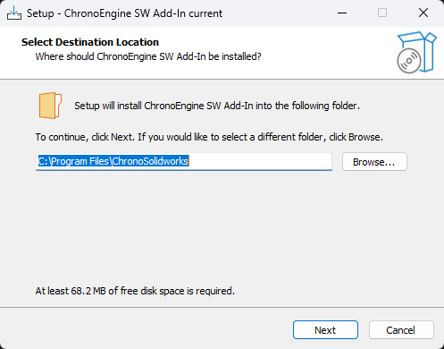
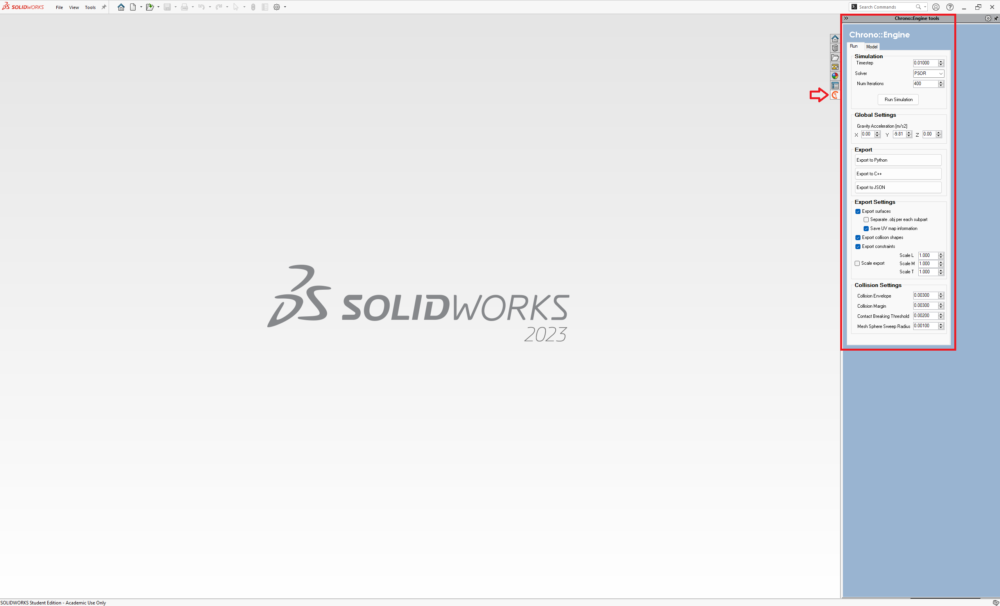

# Chorono Solidworks Plugin - Installation Instructions

The [chrono solidworks](https://api.projectchrono.org/9.0.0/chrono_solidworks_installation.html) is an add-in for [SolidWorks](https://www.solidworks.com/) that allows us to export our models in solidworks for simulation with Chrono.

**Requirements**:

- **OS** - Windows
- **SolidWorks** - Supported version 2011 - 2023 later, 64bit. (As of time of writing)
- **Add-in Installer** - Provided in `acsl-chrono-simulator/libraries/third-party/chrono-solidworks-installer/`

Once you have cloned the repository as specified in the [README](/README.md), the installer will be downloaded onto your machine.

> **IMPORTANT:** Please note that you will need a system running Windows with a copy of Solidworks for this to work. The instructions in [INSTALL](/libraries/INSTALL.md) are written for Ubuntu/Linux. Therefore, you will need a second OS instance of Windows inorder to export your models.

> **IMPORTANT:** The version that is provided with this package corresponds to the Chrono 9.0.1 release. Please note that the add-in version may not be intercompatible with newer or older versions of Chrono. Release specific information regarding the plug-ins can be found [here](https://github.com/projectchrono/chrono/releases).

The provided installer automatically detects the SolidWorks application running on the computer (SolidWorks v.2023 is tested and known to work at the moment, but other versions may work as well) and registers the Chrono::SolidWorks add-in. After installation, the tool is available in the right panel of SolidWorks: this can be used to export CAD assemblies into Chrono-compatible formats or to simulate them directly from SolidWorks.

  

<em>Solidworks Add-in Installer Prompt - Hit Next</em>

> **NOTE:** You do not need to change the installation location or any other parameters and the installer should install the plug-in by auto detecting solidworkds.

  

<em>Solidworks Add-in Pane</em>

# Chorno Solidworks Plugin - Common Usage Instructions

> **IMPORTANT:** Some prior information should be known to successfully export the model:
> - run the export only from _Assemblies_, not from single _Parts_;
> - each _SubAssembly_ is considered as a single rigid body, unless it is set as _Flexible_;
> - Chrono motors are specified through _Coordinate Systems_ objects that must be placed **at top level** (not inside _Parts_);
> - **objects do not collide** by default;
> - collision is set **on Solid Bodies**, not _Parts_;
> - the creation of **Primitive** collision shapes will convert the material of the selected body to `Air`;

## Adding Collision Shapes

> **NOTE:** Collision detection and contacts are very expensive to perform in a simulation. Therefore, we need to flag only the nessary bodies as `collidable` to be be taken into consideration by collision algorithms.

> **NOTE:** To reduce computational load, it is good practive, whenever possible to **wrap complex bodies into primitive shaped** by crerating an additional simple body around the object (the material of this wrapping object is automattically set to `Air`).

## Adding Motors
Chrono motors can be added directly to the SolidWorks model by placing a `Coordinate Sytem` (in Assembly tab -> Reference Geometry). This will act as a placeholder where a proper [ChLinkMotor](https://api.projectchrono.org/9.0.0/classchrono_1_1_ch_link_motor.html) will be later placed durring the export phase.

# How To Use

Navigate [here](/assets/ASSETS.md) to learn about how to use the solidworks plugin to create your own chrono model for simulation.

## 📝 License
The Chrono Project Solidworks plug-in is licensed under the BSD 3-Clause License. See the [LICENSE](https://github.com/projectchrono/chrono-solidworks/blob/master/LICENSE) for more details.